<h1 align="center">The Milk Powder Project</h1>

  <em>This project is about a heat diffusion model of a single 25 kg bag.</em>

  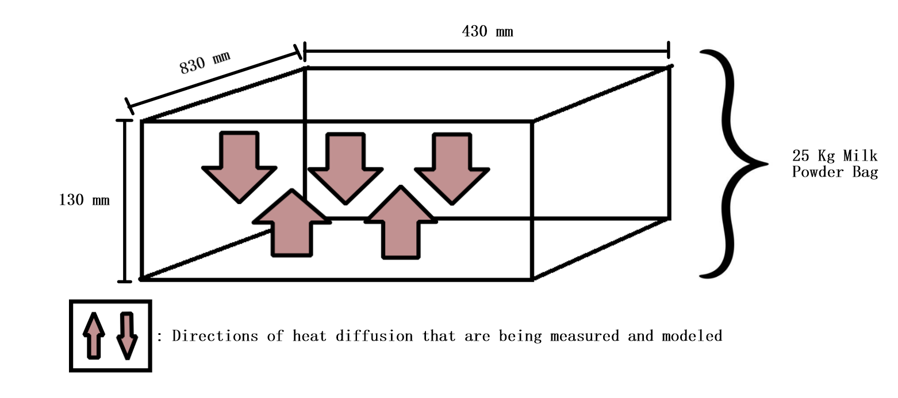

  <b>The setup.</b> A standard 25 kg bag measures 830 × 430 × 130 mm. We model heat moving through the 130 mm thickness (the arrows), to capture the difference between powder near the surface and powder deeper in the bag.

**Authors:** Bea Cooke, Wenting Gu, Holly Sutcliffe, Christopher Won

**Institution:** University of Auckland, MATHS 399

**Quick links:** [Full report (PDF)](report.pdf) · [The model](#the-model) · [Scenarios](#three-scenarios) · [Key findings](#key-findings) · [Implementation](#implementation)

---

## The Question

This project was inspired by a question posed in the MINZ study (Chopovda et al., 2018): *"Can we predict how long we can store milk powders, especially in elevated temperatures and humidities?"*

We focus on **temperature**: how heat moves through a bag of milk powder, and which storage conditions keep it below the point where it starts to degrade.

The MINZ baseline is milk powder stored at 25 °C with water activity aw = 0.225 and 60% relative humidity, which has a predicted shelf life of **770 days**. Allowing up to one year in the supply chain, the consumer keeps roughly **405 days** to use the product.

  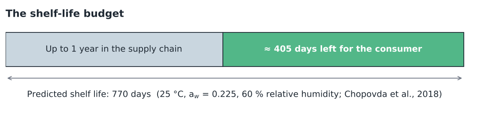

## Why Temperature Matters

Two things go wrong when the powder gets too warm:

- **Lactose crystallisation and browning** once the temperature passes a critical threshold.
- **Glass transition** at about **50 °C** (with aw ≈ 0.22), which causes complex inter-particle bridging and speeds up the degrading reactions.

The danger is also uneven: the surface of a bag can sit at a very different temperature from its centre. That is why we model heat *through* the bag rather than treating it as one number.

  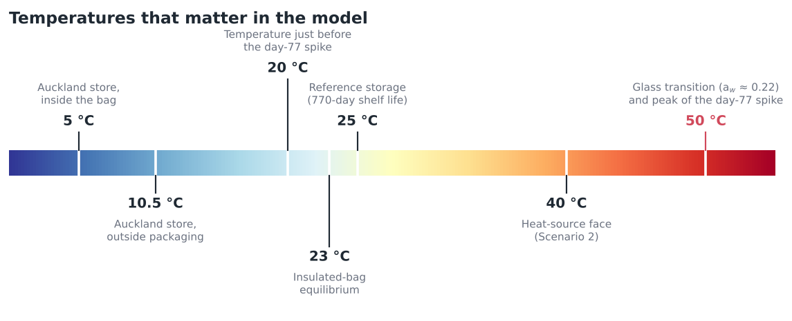

## The Model

We use the **1D homogeneous heat diffusion equation** (Olver, 2014):

$$\frac{\partial u}{\partial t} = \gamma \, \frac{\partial^2 u}{\partial x^2}$$

| Symbol | Meaning | Value |
|---|---|---|
| `u(x, t)` | temperature at position x and time t | |
| `γ` | thermal diffusivity, γ = δ / (ρ Cp) | ≈ 0.7 mm²/s for milk powder |
| `x` | position through the bag | 0 to 130 mm |

Each scenario below pairs this equation with different **boundary conditions** (what happens at the two faces of the bag) and an **initial temperature profile**, and is solved as a Fourier series.

  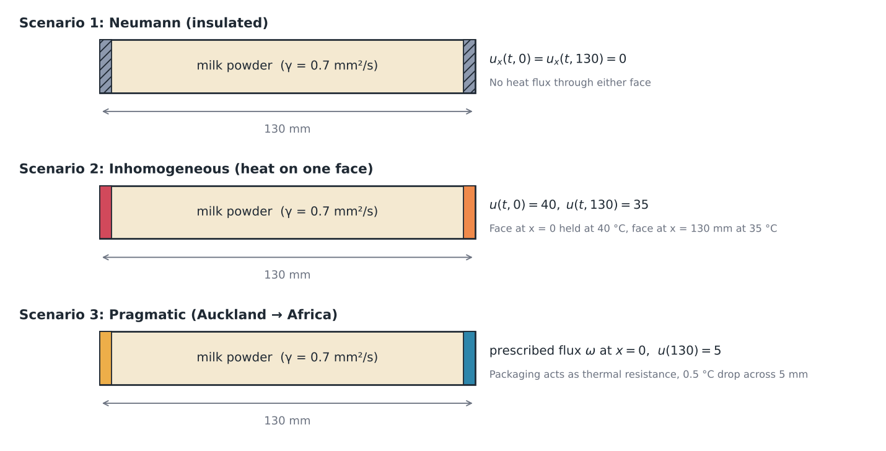

## Three Scenarios

### 1. Neumann boundary conditions: insulated packaging

Zero heat flux at both ends, `u_x(t,0) = u_x(t,130) = 0`, with initial profile `u(0,x) = 23 + cos(x)`. Nothing can enter or leave the bag, so the temperature ripples die out and the bag settles at a uniform **23 °C**. This is the theoretically ideal storage case.

<table>
  <tr>
    <td align="center" width="50%">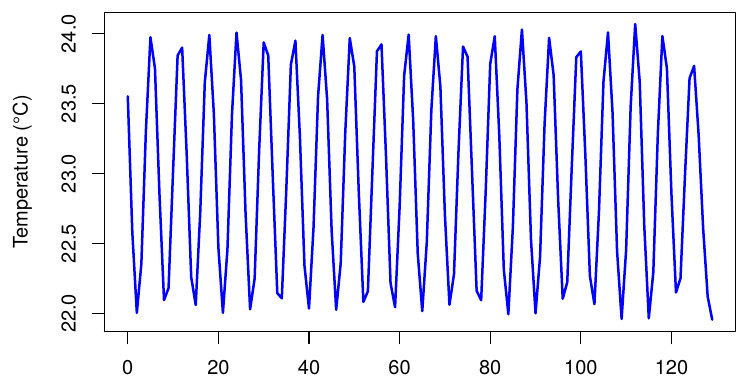</td>
    <td align="center" width="50%">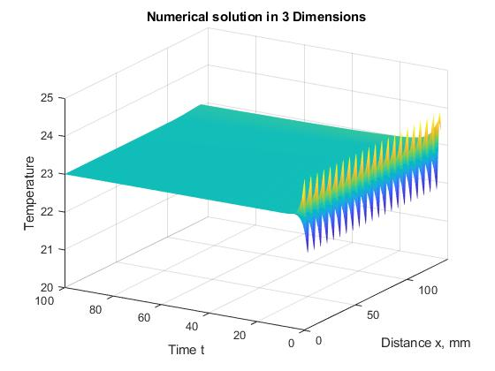</td>
  </tr>
  <tr>
    <td align="center"><b>Initial profile</b> across the 130 mm of powder</td>
    <td align="center"><b>Over time:</b> the ripples flatten out to 23 °C</td>
  </tr>
</table>

### 2. Inhomogeneous boundary conditions: direct heat exposure

One face is held at 40 °C (the bag lying face down on a heat source) and the other at 35 °C: `u(t,0) = 40`, `u(t,130) = 35`. Heat floods in from the hot face, then the profile smooths out and converges to a straight line, `u = 40 − (5/130)·x`.

<table>
  <tr>
    <td align="center" width="50%">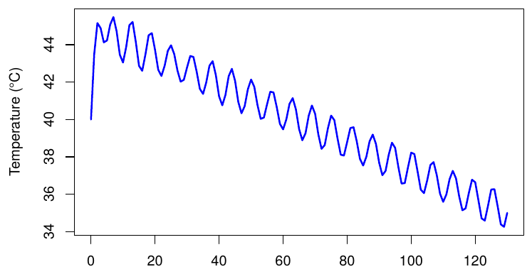</td>
    <td align="center" width="50%">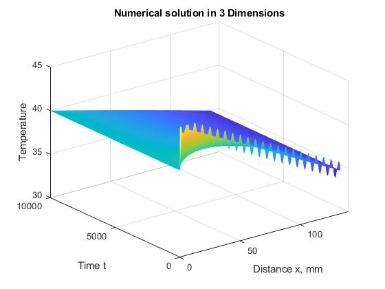</td>
  </tr>
  <tr>
    <td align="center"><b>Initial profile</b></td>
    <td align="center"><b>Over time:</b> a spike at the hot face that smooths into a linear profile</td>
  </tr>
</table>

### Watching the heat move

The animation and snapshots below are generated from the report's analytical solutions (50 term Fourier series, γ = 0.7 mm²/s). With that diffusivity, a 130 mm slab relaxes to equilibrium within a few hours.

  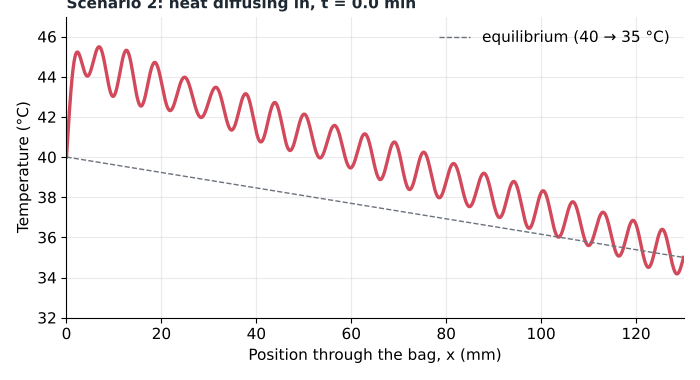

  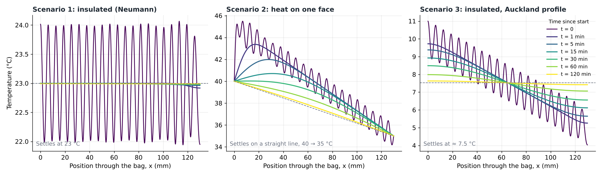

### 3. Pragmatic scenario: Auckland to Africa (about 90 days)

To test the model on something realistic, we follow one bag shipped from Auckland to an African country, using the MINZ temperature records for the journey.

- **Starting point.** In an Auckland store the outside is 10.5 °C and the inside of the bag is 5 °C. We assume a 0.5 °C drop across the 5 mm packaging (0.19 mm LDPE inner layer glued to a paper bag), which gives a heat flux into the powder.
- **Initial profile.** Setting the flux and the 5 °C base temperature gives a steady state that falls linearly through the bag: `u(x) = (ω/δ)(0.130 − x) + p`, running from about 10 °C at the surface to 5 °C.
- **Making it realistic.** Heat rarely travels in a perfect line, so a sinusoidal term is added to the linear profile. With insulated ends, this profile settles at about **7.5 °C**.

<table>
  <tr>
    <td align="center" width="33%">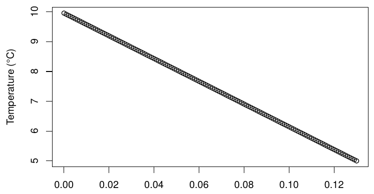</td>
    <td align="center" width="33%">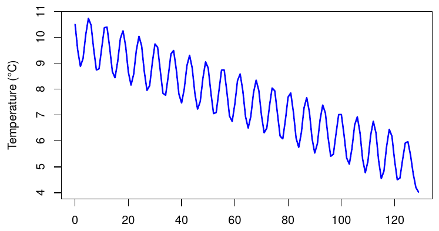</td>
    <td align="center" width="33%">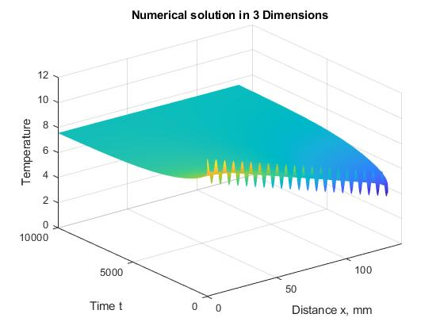</td>
  </tr>
  <tr>
    <td align="center"><b>Steady state</b> in the Auckland store: a straight line</td>
    <td align="center"><b>With a sinusoidal term</b> for a more realistic profile</td>
    <td align="center"><b>Over time:</b> settling at about 7.5 °C</td>
  </tr>
</table>

#### Two events from the shipment

The MINZ data show two moments that matter for the powder:

1. **Reaching the glass transition (50 °C), first at about day 36.5.** The bag starts near 26 °C and its surroundings reach 50 °C.
2. **A sudden 30 °C spike at about day 77.** A bag hovering around 20 °C is suddenly pushed to 50 °C.

<table>
  <tr>
    <td align="center" width="50%">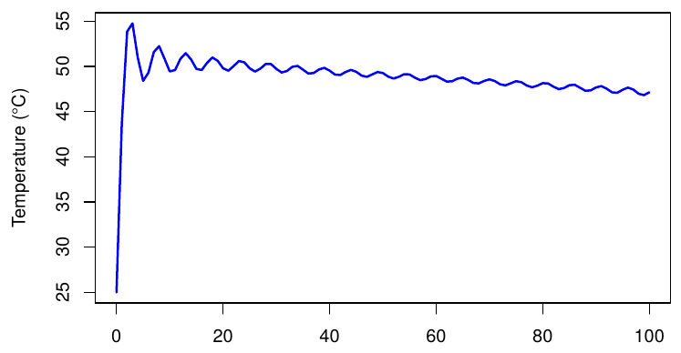</td>
    <td align="center" width="50%">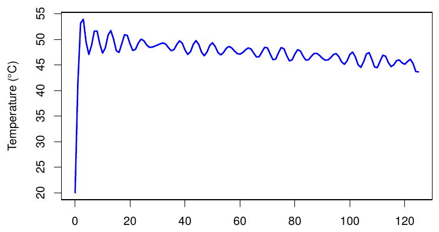</td>
  </tr>
  <tr>
    <td align="center"><b>Glass transition:</b> the profile jumps to 50 °C at the surface and then decays</td>
    <td align="center"><b>Sudden spike:</b> an instant 30 °C rise from about 20 to 50 °C</td>
  </tr>
</table>

> **Caveat.** The spike is modelled as instantaneous; in reality the rise would take up to a few hours. The MINZ data also do not say whether the readings were surface or interior temperatures, so the heat flux values are estimates (we had no heat flux sensors).

## Key Findings

| Condition | Outcome |
|---|---|
| Neumann (insulated) boundary conditions | Optimal: keeps the shelf life at 770 days or more, provided aw and humidity are held |
| Thickened packaging | Practical: delays the glass transition by increasing heat loss through the walls |
| Uninsulated or thin packaging | Risk of reaching the 50 °C glass transition and accelerated degradation |

**Optimal condition 1: full insulation (Neumann boundary conditions).** Theoretically ideal, and it would make the location of the powder matter much less, even with temperature swings like those in the MINZ data. It is not achievable with standard multi-wall paper and LDPE bags, so a different packaging material would be needed.

**Optimal condition 2: thickened packaging.** Increasing the thickness of the paper and LDPE layers, especially on the sides most likely to face the sun or another heat source, increases heat loss before the heat reaches the powder and delays the glass transition. This is more practical and manufacturable, though it costs more material and may slow production.

## Implementation

All models were implemented numerically using **R** (Fourier series solutions, 50 term approximations) and **MATLAB** (3D surface plots via `pdepe`). The code is included in the appendix of the [report](report.pdf).

## Repository Contents

| File | Description |
|---|---|
| [`The Milk Powder Project.pdf`](report.pdf) | Full project report with derivations, figures, and R/MATLAB code |
| [`images/`](images) | Figures from the report and illustrations generated from its model, used in this README |

## References

- Chopovda, V., Clarke, R.J., Fowler, A.C., Fullard, L.A., Goodman, J., Thomasen, L.M., & Taylor, S.W. (2018). [*Predicting the shelf life of milk powder.*](https://journal.austms.org.au/ojs/index.php/ANZIAMJ/article/view/12554) ANZIAM Journal.
- Olver, P.J. (2014). *Introduction to Partial Differential Equations.* Springer.
- Mueller, B. (2010). *Package Optimisation Model.* Massey University.
